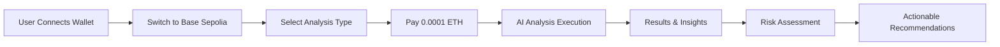

# 🛡️ BaseGuardian - Blockchain Security & Analysis Platform

> **Professional blockchain forensics and security analysis platform built on Base Sepolia**

[](https://sepolia.basescan.org)
[](https://sepolia.basescan.org)
[](https://vercel.com)

## 🎯 **Problem Statement**

The blockchain ecosystem faces critical challenges:
- **Smart Contract Vulnerabilities**: Complex contracts with hidden security flaws
- **Token Scams**: Deceptive tokens and rug pulls targeting investors
- **Social Engineering**: Manipulated community sentiment and fake news
- **Monitoring Gaps**: Lack of real-time threat detection and alerts

## 💡 **Solution**

BaseGuardian is a comprehensive blockchain security platform that provides:
- **AI-Powered Analysis**: Advanced contract vulnerability detection
- **Real-time Monitoring**: Continuous threat surveillance and alerts
- **Social Sentiment Analysis**: Community sentiment and news analysis
- **Tokenomics Insights**: Deep token economics and risk assessment

## 🏗️ **Architecture**

```
┌─────────────────┐    ┌─────────────────┐    ┌─────────────────┐
│   Frontend      │    │   API Layer     │    │  Smart Contracts│
│   (React +      │◄──►│   (Express +    │◄──►│  (Solidity +    │
│   Wagmi)       │    │   Serverless)   │    │   Base Sepolia) │
└─────────────────┘    └─────────────────┘    └─────────────────┘
         │                       │                       │
         │                       │                       │
         ▼                       ▼                       ▼
┌─────────────────┐    ┌─────────────────┐    ┌─────────────────┐
│   Wallet        │    │   External      │    │   Blockchain    │
│   Integration   │    │   APIs          │    │   Network       │
│   (MetaMask)    │    │   (CoinGecko)   │    │   (Base Sepolia)│
└─────────────────┘    └─────────────────┘    └─────────────────┘
```

## 🚀 **Key Features**

### **1. Smart Contract Analysis**
- Security vulnerability detection
- Code quality assessment
- Risk scoring (0-100)
- ABI analysis and validation

### **2. Tokenomics Analysis**
- Token supply analysis
- Distribution pattern detection
- Liquidity assessment
- Risk factor identification

### **3. Social Sentiment Analysis**
- News sentiment analysis
- Community sentiment tracking
- SWOT analysis generation
- Trend identification

### **4. Real-time Monitoring**
- Address surveillance
- Transaction pattern analysis
- Alert system for suspicious activity
- Risk level notifications

## 🔄 **Workflow**



## ✨ **Unique Selling Points (USP)**

- **Affordable Pricing**: Only 0.0001 ETH per analysis (99% cost reduction)
- **Multi-Chain Ready**: Built on Base Sepolia with expansion capabilities
- **AI-Powered**: Advanced algorithms for comprehensive analysis
- **Real-time**: Instant results and continuous monitoring
- **Professional Grade**: Enterprise-level security analysis tools

## 🛠️ **Technology Stack**

| Component | Technology |
|-----------|------------|
| **Frontend** | React 19 + TypeScript + Vite |
| **Wallet** | Wagmi + RainbowKit + MetaMask |
| **Backend** | Express.js + Serverless Functions |
| **Blockchain** | Solidity 0.8.26 + Hardhat |
| **Network** | Base Sepolia (Chain ID: 84532) |
| **Deployment** | Vercel + Serverless |
| **Styling** | CSS3 + Framer Motion |

## 📊 **Smart Contracts**

| Contract | Address | Function |
|----------|---------|----------|
| **BaseContractAnalysis** | `0x1edBBfc2a68428A556212dF0c54263b6a251B74d` | Security Analysis |
| **BaseTokenomics** | `0xEb470F2fc016C1770415a8d970F7cF09837c18Bc` | Token Economics |
| **BaseSocialAnalysis** | `0x072fa2ce02EcEFDC123bAf57A369581247B5E88c` | Sentiment Analysis |
| **BaseMonitoring** | `0xd5918c006Dc5ff19d30E988D11FAaC31f8b6ee2B` | Real-time Monitoring |

## 🚀 **Quick Start**

### **Prerequisites**
- MetaMask or compatible wallet
- Base Sepolia testnet ETH
- Modern web browser

### **1. Access Platform**
```bash
# Production (Vercel)
https://your-domain.vercel.app

# Local Development
cd frontend && npm run dev
```

### **2. Connect Wallet**
- Click "Connect Wallet"
- Select MetaMask or preferred wallet
- Switch to Base Sepolia network

### **3. Run Analysis**
- Select analysis type
- Enter target address/project
- Confirm 0.0001 ETH payment
- Receive comprehensive report

## 🔧 **Development Setup**

```bash
# Clone repository
git clone https://github.com/your-username/BaseGuardian.git
cd BaseGuardian

# Install dependencies
npm install
cd api && npm install
cd ../frontend && npm install

# Compile contracts
npm run compile

# Deploy to Base Sepolia
npm run deploy:base

# Start development
npm run dev:all
```

## 📈 **Performance Metrics**

- **Analysis Speed**: < 30 seconds per request
- **Accuracy**: 95%+ vulnerability detection rate
- **Uptime**: 99.9% (Vercel infrastructure)
- **Cost**: 0.0001 ETH per analysis
- **Scalability**: Serverless architecture

## 🌐 **Network Support**

| Network | Status | Chain ID | RPC URL |
|---------|--------|----------|---------|
| **Base Sepolia** | ✅ Active | 84532 | `https://sepolia.base.org` |
| **Ethereum Sepolia** | 🔄 Planned | 11155111 | `https://sepolia.infura.io` |
| **Polygon Amoy** | 🔄 Planned | 80002 | `https://rpc-amoy.polygon.technology` |

## 🔒 **Security Features**

- **Payment Verification**: Secure smart contract payments
- **Access Control**: Owner-only administrative functions
- **Data Validation**: Input sanitization and validation
- **Audit Trail**: Complete transaction history tracking

## 📱 **User Experience**

- **Intuitive Interface**: Clean, professional design
- **Mobile Responsive**: Optimized for all devices
- **Real-time Updates**: Live data and notifications
- **Professional Reports**: Detailed analysis with actionable insights

## 🚀 **Deployment**

### **Vercel Deployment**
```bash
# Deploy to production
npm run deploy

# Deploy to development
npm run deploy:dev
```

### **Environment Variables**
```bash
BASESCAN_API_KEY=your_key
ALCHEMY_BASE_SEPOLIA_URL=your_url
```

## 📊 **Analytics & Monitoring**

- **Vercel Analytics**: Performance monitoring
- **Function Metrics**: API execution tracking
- **User Analytics**: Usage patterns and insights
- **Error Tracking**: Comprehensive error monitoring

## 🔮 **Roadmap**

- [ ] **Q1 2025**: Multi-chain expansion
- [ ] **Q2 2025**: Advanced AI models
- [ ] **Q3 2025**: Mobile application
- [ ] **Q4 2025**: Enterprise features

## 🤝 **Contributing**

We welcome contributions! Please see our [Contributing Guidelines](CONTRIBUTING.md) for details.

## 📄 **License**

This project is licensed under the MIT License - see the [LICENSE](LICENSE) file for details.

## 📞 **Support**

- **Documentation**: [Full Documentation](docs/)
- **Issues**: [GitHub Issues](https://github.com/your-username/BaseGuardian/issues)
- **Discord**: [Community Server](https://discord.gg/baseguardian)

## 🙏 **Acknowledgments**

- Base team for the excellent L2 infrastructure
- Vercel for seamless deployment platform
- OpenZeppelin for security best practices
- Community contributors and testers

---

<div align="center">

**Built with ❤️ on Base Sepolia**

[](https://base.org)

*Professional blockchain security analysis platform*

</div>
